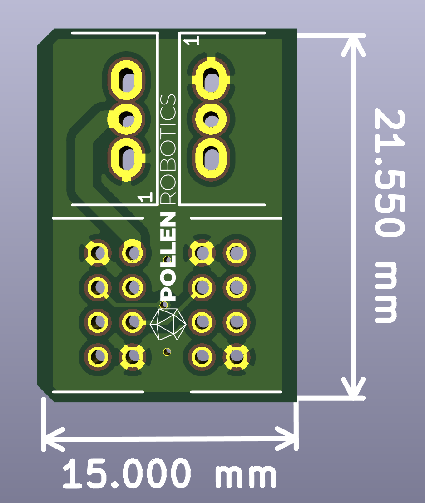

# cable_extension
This repository contains the KiCad project of the board used to connect the Reachy's Wrist to the rest of the arm.
It is useful for two reasons:
- It allows us to remove the wrist from the arm easily
- The wrist and the rest of the arm don't share the same 12V source so each of them has more power than if they were on the same 12V input.

## Additional Components

This PCB can't work alone, it needs a few Components soldered on it:
- 2x DF11-8DP-2DS(24) connectors
- 2x 22-05-7035 connectors
